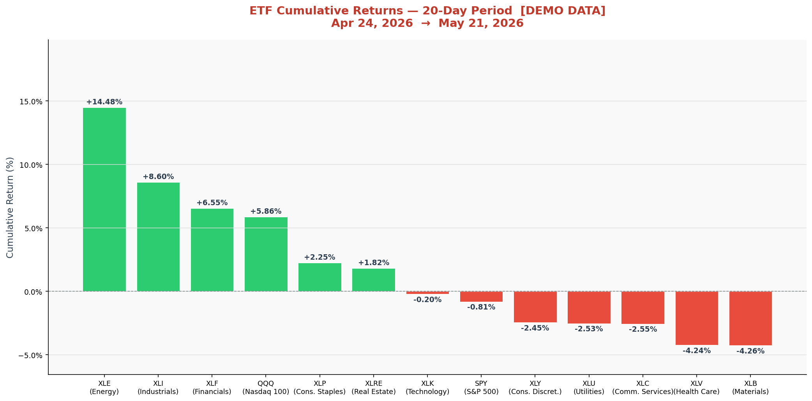

# ETF Returns Dashboard

Descarga automática diaria de los últimos **20 días de cotización** para SPY, QQQ y los ETFs sectoriales SPDR. Genera un bar chart de retornos acumulados ordenado de mayor a menor.

## Último gráfico



> Actualizado automáticamente cada día laborable a las **08:00 UTC** via GitHub Actions.

## ETFs incluidos

| Ticker | Sector |
|--------|--------|
| SPY | S&P 500 |
| QQQ | Nasdaq 100 |
| XLK | Technology |
| XLF | Financials |
| XLV | Health Care |
| XLI | Industrials |
| XLY | Consumer Discretionary |
| XLP | Consumer Staples |
| XLE | Energy |
| XLB | Materials |
| XLC | Communication Services |
| XLRE | Real Estate |
| XLU | Utilities |

## Ejecución manual

```bash
pip install -r requirements.txt
python etf_returns.py
```
